# CityBlockMap_Mobile

Sistema web para mapeamento de quadras e bairros de uma cidade. Desenvolvido para facilitar a localização de quadras e bairros, sendo especialmente útil para empresas de prestação de serviço que precisam mapear e consultar quadras rapidamente.

> **Frontend migrado para Flutter:** o frontend original em Angular foi substituído por **Flutter**, permitindo o uso do sistema tanto na web quanto em dispositivos móveis (Android) a partir de uma única codebase. As funcionalidades do backend permanecem as mesmas.

---

## Sobre este projeto

Este repositório documenta a migração solo do frontend do CityBlockMap, originalmente em Angular, para **Flutter**. O objetivo foi permitir que a mesma aplicação rodasse tanto na web quanto em dispositivos móveis, sem alterar o backend existente.

Ao longo da migração, foram trabalhados:

- Recriação de todas as telas e fluxos do sistema original (autenticação, CRUD de bairros e quadras, gerenciamento de usuários, controle de acesso por perfil)
- Roteamento e proteção de rotas (`go_router`, guards de autenticação e autorização)
- Integração com mapas (`flutter_map`), incluindo seleção de coordenadas por toque
- Tratamento de sessão expirada com feedback visual e logout automático
- Layout responsivo, adaptado tanto para telas largas (web) quanto estreitas (celular)
- Containerização da versão web com Docker + Nginx, integrada ao `docker-compose` já existente do projeto
- Diagnóstico e correção de bugs específicos de cada plataforma

---

## Screenshots
 
### Dashboard (visão do administrador)
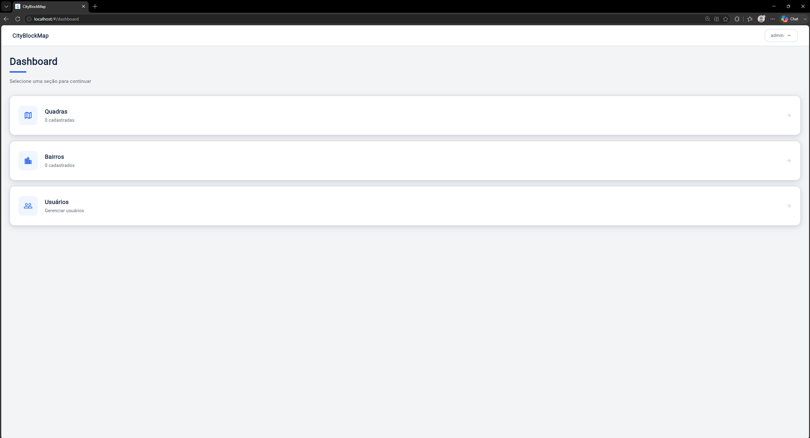
 
O menu do administrador tem acesso completo: cadastro de usuários, bairros e quadras, além das configurações.
 
### Seleção de localização no mapa
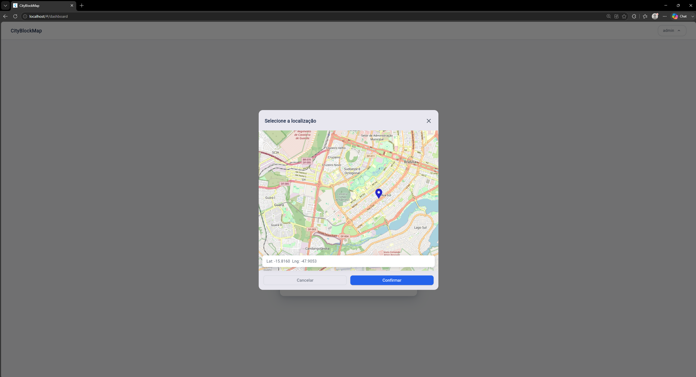
 
Ao cadastrar uma quadra, é possível clicar diretamente no mapa para definir a latitude e longitude, em vez de digitar os valores manualmente.
 
### Lista de bairros e quadras
| Visão do administrador | Visão do usuário comum |
|---|---|
| 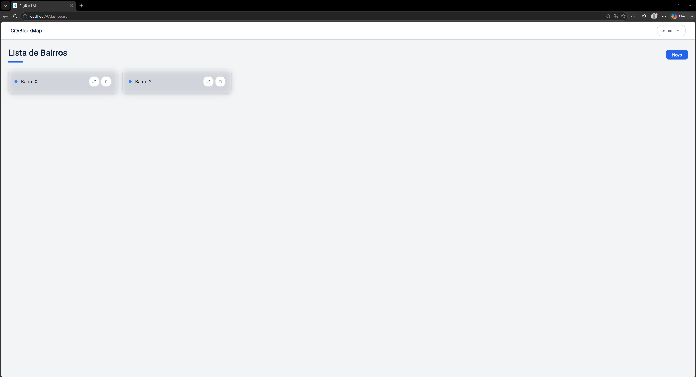 | 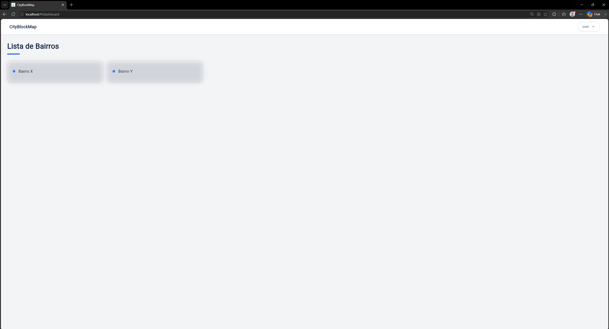 |
| 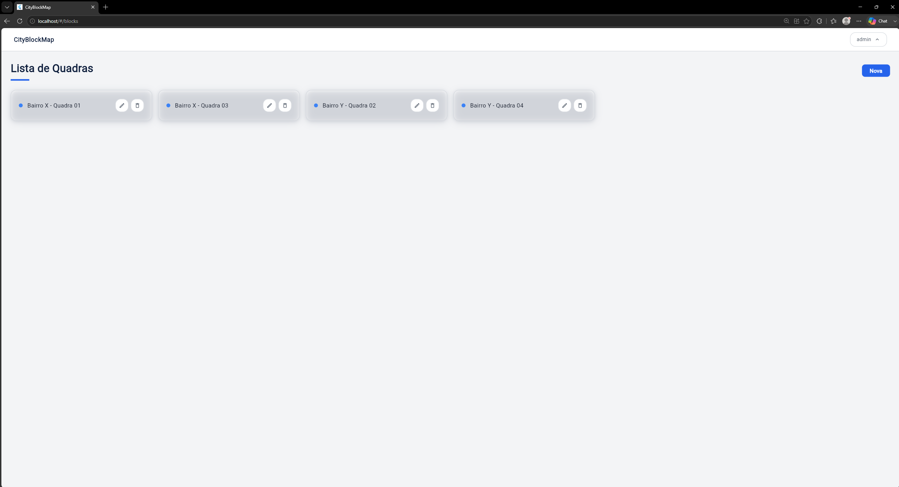 | 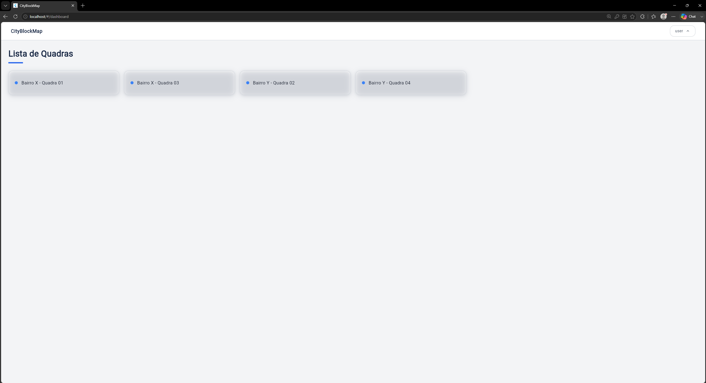 |
 
O usuário comum visualiza as mesmas listas, porém sem os botões de editar e excluir — esse controle de acesso é validado tanto no frontend quanto no backend.
 
### Detalhe de uma quadra no mapa
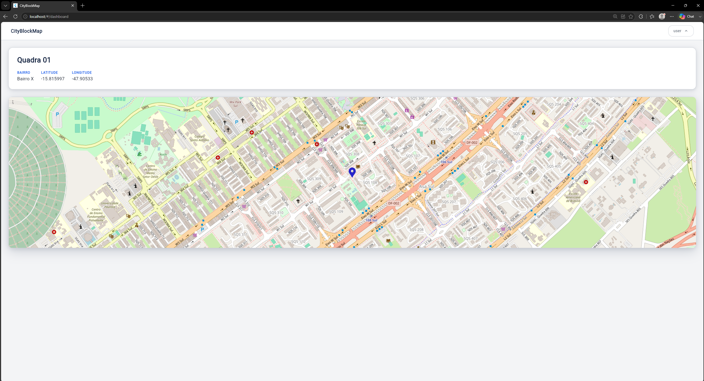
 
### Gerenciamento de usuários (acesso restrito a administradores)
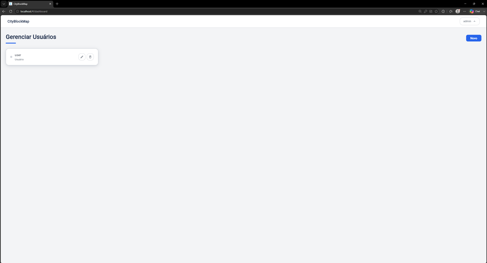
 
Tela exclusiva para usuários com perfil ADMIN, listando os demais usuários cadastrados (o usuário atualmente logado não aparece na própria lista), com opções de criar, editar e excluir.
 
---
 
## Screenshots (Mobile)
 
As mesmas telas da versão web, agora rodando nativamente em um emulador Android.
 
### Dashboard (visão do administrador)
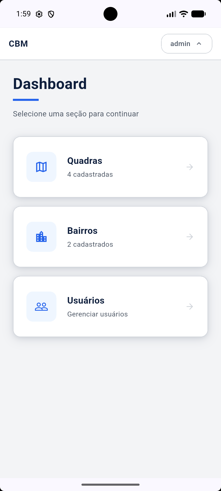
 
### Seleção de localização no mapa
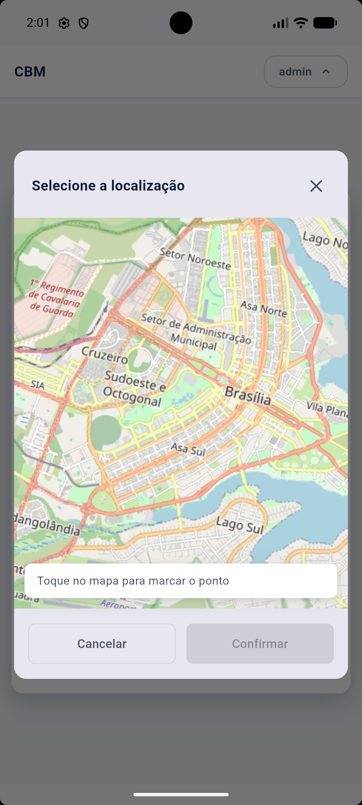
 
### Lista de bairros e quadras
| Visão do administrador | Visão do usuário comum |
|---|---|
| 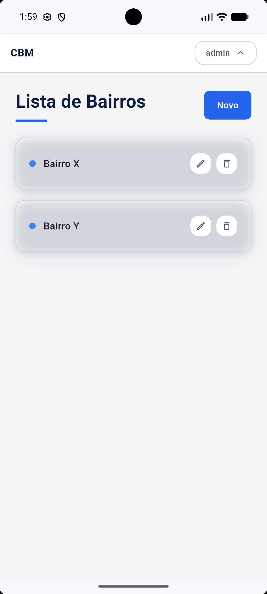 | 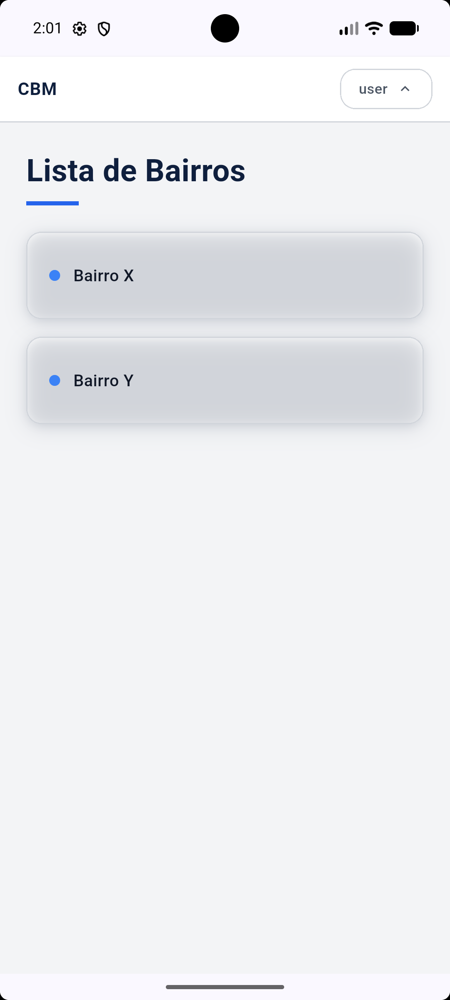 |
| 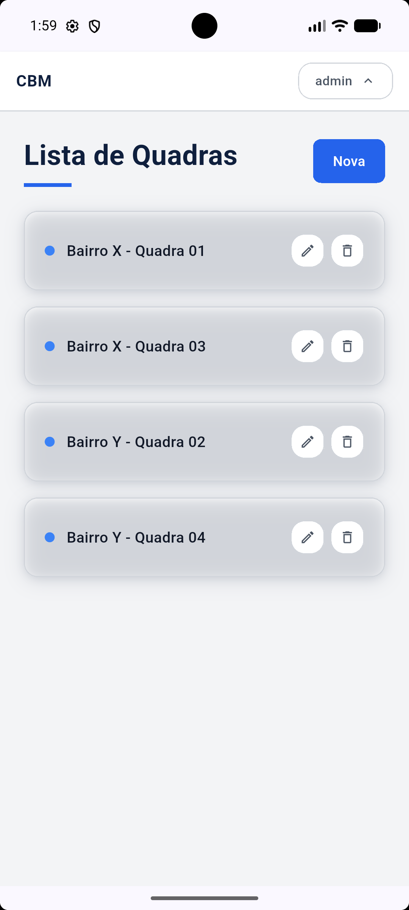 | 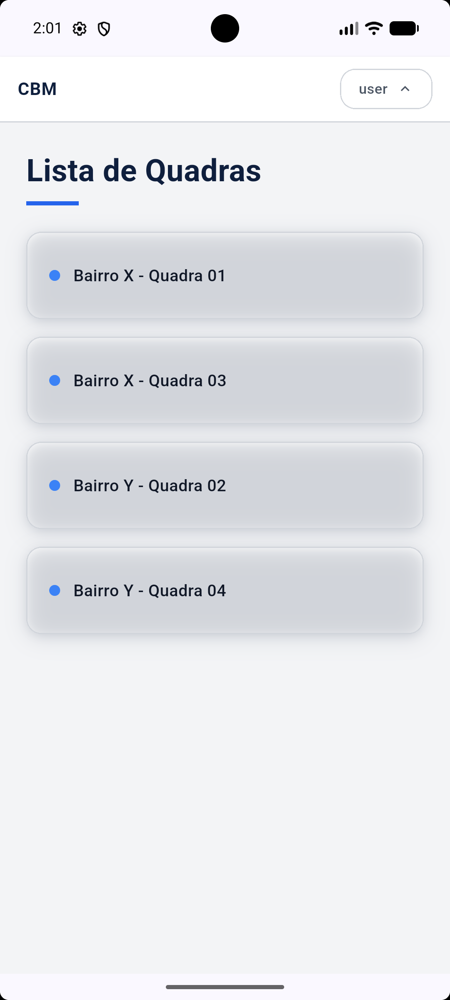 |
 
### Detalhe de uma quadra no mapa
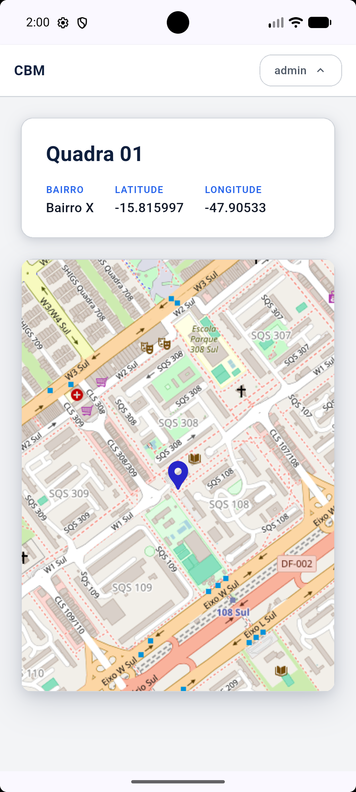
 
### Gerenciamento de usuários (acesso restrito a administradores)
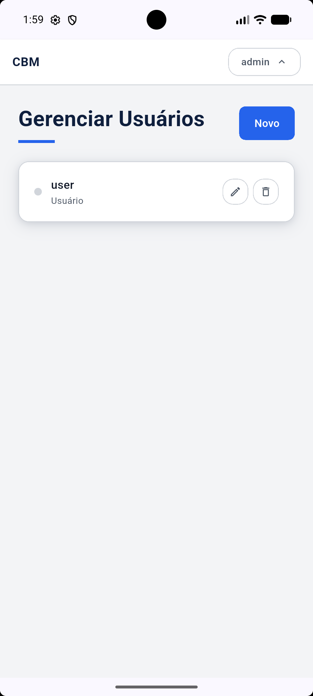
 
---

## Funcionalidades

- Cadastro, edição e exclusão de quadras e bairros
- Visualização de quadras no mapa com marcação de coordenadas
- Seleção de localização diretamente no mapa ao cadastrar uma quadra
- Gerenciamento de usuários com perfis **ADMIN** e **USER**
- Autenticação via JWT com expiração automática de sessão
- Dashboard com contadores de quadras e bairros cadastrados
- Controle de acesso por perfil — apenas ADMINs podem cadastrar, editar e excluir
- Layout responsivo, adaptado tanto para telas largas (web) quanto estreitas (celular)

---

## Tecnologias

**Backend**
- Java 21
- Spring Boot 3.5
- Spring Security + JWT
- JPA / Hibernate
- PostgreSQL
- Flyway (migrations)
- Maven
- Docker

**Frontend**
- Flutter + Dart
- go_router (roteamento e guards de autenticação/autorização)
- http (requisições HTTP)
- shared_preferences (armazenamento do token JWT)
- flutter_map + latlong2
- Docker + Nginx (build e servidor de produção da versão web)

---

## Pré-requisitos

- [Docker](https://www.docker.com/) instalado — necessário para rodar a versão **web** e para o backend/banco de dados usados pela versão **mobile**
- [Flutter SDK](https://docs.flutter.dev/get-started/install) instalado — necessário apenas para rodar a versão **mobile** em um emulador ou dispositivo físico
- Dois arquivos de configuração que **não foram para o repositório** por conterem dados sensíveis (veja a seção abaixo)

---

## ⚠️ Configuração obrigatória antes de rodar

O projeto precisa de **dois arquivos** que não são versionados no Git. Sem eles, o backend não inicializa — isso vale tanto para rodar a versão web quanto a versão mobile.

### 1. Arquivo `.env` na raiz do projeto

Crie um arquivo chamado `.env` na raiz do repositório (mesma pasta do `docker-compose.yml`) com o seguinte conteúdo:

```env
JWT_SECRET=CRIE ALGUMA CHAVE JWT ALEATORIA AQUI

POSTGRES_USER=usuario do postgres
POSTGRES_PASSWORD=senha do postgres
POSTGRES_DB=cityblockmap

SPRING_DATASOURCE_URL=jdbc:postgresql://postgres:5432/cityblockmap
DB_USERNAME=usuario do postgres
DB_PASSWORD=senha do postgres

ADMIN_DEFAULT_PASSWORD=defina uma senha forte para o usuário admin
```

> `POSTGRES_USER` e `POSTGRES_PASSWORD` criam o usuário e senha do **banco de dados** na primeira vez que o container sobe.

> `DB_USERNAME` e `DB_PASSWORD` são as credenciais que o **backend Spring Boot** usa para se conectar ao banco. Devem ter os mesmos valores de `POSTGRES_USER` e `POSTGRES_PASSWORD`.

> `SPRING_DATASOURCE_URL` define a URL de conexão usada dentro do Docker. O nome `postgres` no meio da URL é o nome do serviço do banco de dados no `docker-compose.yml` — o Docker resolve automaticamente para o IP correto do container.

> `ADMIN_DEFAULT_PASSWORD` define a senha do usuário **admin** padrão da aplicação (não do banco de dados). A cada inicialização, o backend verifica se o admin existe e se sua senha ainda é a padrão original — se for, ele a substitui pelo valor definido aqui. Isso evita ter qualquer senha fixa no código-fonte.

## JWT_SECRET
O `JWT_SECRET` deve ser uma string longa e aleatória. Você pode gerar uma com:

```bash
powershell -Command "[System.Convert]::ToBase64String([System.Security.Cryptography.RandomNumberGenerator]::GetBytes(32))"
```

ou seguir o seguinte padrão:

```env
Z7uF2mL9QpX5wVr8NcB1sKd6TyJ4HgEaP0fRn3UvWxYzA8Cb
```

É importante que seja de 32 a 64 bytes gerados aleatoriamente por questões de segurança.

### 2. Arquivo `application-prod.properties` no backend

Crie o arquivo em `cityblockmap - Backend/src/main/resources/application-prod.properties`:

```properties
spring.datasource.url=jdbc:postgresql://localhost:5432/cityblockmap
spring.datasource.username=${DB_USERNAME:postgres}
spring.datasource.password=${DB_PASSWORD:postgres}
spring.datasource.driver-class-name=org.postgresql.Driver

spring.jpa.database-platform=org.hibernate.dialect.PostgreSQLDialect
spring.jpa.hibernate.ddl-auto=none
spring.jpa.show-sql=false
spring.jpa.properties.hibernate.format_sql=false

api.security.token.secret=${JWT_SECRET}

spring.flyway.enabled=true
spring.flyway.baseline-on-migrate=true
spring.flyway.locations=classpath:db/migration
```

> A `spring.datasource.url` deste arquivo usa `localhost` propositalmente como valor padrão, permitindo execução fora do Docker. Quando rodado via `docker-compose`, a variável `SPRING_DATASOURCE_URL` definida no `.env` **sobrescreve automaticamente** esse valor (variáveis de ambiente do sistema têm prioridade sobre o `.properties` no Spring Boot), apontando corretamente para o serviço `postgres` da rede Docker.

>`DB_USERNAME` ou `DB_PASSWORD` são o usuário e senha usados para conectar no banco de dados que foi definido no `.env`. Caso a variável de ambiente não exista, ele vai utilizar como usuário e senha a palavra `postgres`.

---

## Como rodar a versão Web

### Opção 01 — Docker (recomendado)

Sobe o backend, o banco de dados e o frontend web em um único comando. Após criar os dois arquivos de configuração da seção anterior:

```bash
docker-compose up -d --build
```

Aguarde os containers subirem e acesse:

- **Frontend (web):** http://localhost
- **Backend:** http://localhost:8080

O banco de dados é criado automaticamente pelo Flyway na primeira execução.

> O frontend é compilado a partir do projeto Flutter (`flutter build web`) e servido por um container Nginx — o mesmo padrão multi-stage usado neste [repositório](https://github.com/LuisRuppenthal/CityBlockMap) com o Angular, apenas trocando as ferramentas de build.

### Opção 02 — Desenvolvimento local (sem Docker no frontend)

Útil para desenvolver com hot reload, sem precisar rebuildar a imagem Docker a cada alteração.

**Backend** (via Docker ou localmente):
```bash
cd "cityblockmap - Backend"
mvn spring-boot:run
```
O perfil de desenvolvimento usa banco H2.

**Frontend:**
```bash
cd cityblockmap_mobile
flutter pub get
flutter run -d edge
```

---

## Como rodar a versão Mobile (Android)

Diferente da versão web, a versão mobile **não roda dentro do Docker** — ela é instalada nativamente em um emulador ou dispositivo físico através do próprio Flutter. O Docker continua responsável apenas pelo backend e pelo banco de dados.

### 1. Suba o backend e o banco (Docker)

```bash
docker-compose up -d --build backend postgres
```

### 2. Instale as dependências do Flutter

```bash
cd cityblockmap_mobile
flutter pub get
```

### 3. Configure um emulador Android

Se você ainda não tem nenhum emulador criado, confira primeiro o que já existe disponível:

```bash
flutter emulators
```

Se a lista vier vazia, crie um novo dispositivo virtual (AVD) pelo **Android Studio**:

1. Abra o Android Studio
2. Vá em **More Actions → Virtual Device Manager** (ou **Tools → Device Manager**, se já tiver um projeto aberto)
3. Clique em **Create Device**
4. Escolha um dispositivo (ex: **Pixel 7** ou **Pixel 8**) → **Next**
5. Escolha uma imagem de sistema (System Image) — veja a seção abaixo sobre qual versão escolher — e baixe-a se ainda não tiver localmente → **Next**
6. **Finish**

Alternativamente, pelo terminal:

```bash
flutter emulators --create --name meu_emulador
```

Com o emulador criado, inicie-o:

```bash
flutter emulators --launch <nome_do_emulador>
```

**Quais versões de Android são compatíveis?**

Recomenda-se uma imagem de sistema **Android 13 (API 33) ou superior**. Versões mais recentes (Android 14/API 34 em diante) tendem a ter melhor suporte a bibliotecas atuais do Flutter e menos avisos de compatibilidade durante o build. Prefira imagens **"Google Play"** ou **"Google APIs"** (em vez de "Google APIs Intel x86 Atom" antigas ou imagens sem Google Play Services), que garantem melhor compatibilidade geral.

Emuladores com versões muito antigas do Android (abaixo da API 21) não são suportados pelo Flutter.

### 4. Rode o app

```bash
flutter run
```

O Flutter detecta automaticamente o emulador conectado e instala o app nele.

> **Nota técnica:** o app ajusta sozinho a URL da API dependendo de onde está rodando. No emulador Android, `127.0.0.1` aponta para o próprio dispositivo virtual (não para o computador host) — por isso a aplicação usa o endereço especial `10.0.2.2`, que redireciona de volta para o backend rodando no Docker. Na web e no desktop, a URL padrão (`127.0.0.1`) é usada normalmente.

---

## Primeiro acesso

Um usuário **admin** é criado/atualizado automaticamente na inicialização do backend, com login `admin` e a senha definida na variável `ADMIN_DEFAULT_PASSWORD` do seu `.env`.

> Nenhuma senha fica fixa no código-fonte ou nas migrations. Se você trocar a senha do admin diretamente pela aplicação, o backend deixa de sobrescrevê-la nas próximas inicializações — a sobrescrita só ocorre enquanto a senha estiver no valor padrão original.

---

## Variáveis de ambiente

| Variável | Onde é usada | Descrição |
|---|---|---|
| `JWT_SECRET` | `.env` e `application-prod.properties` | Chave secreta para assinar os tokens JWT |
| `POSTGRES_USER` | `.env` | Usuário criado no banco de dados PostgreSQL |
| `POSTGRES_PASSWORD` | `.env` | Senha do usuário do PostgreSQL |
| `POSTGRES_DB` | `.env` | Nome do banco de dados |
| `SPRING_DATASOURCE_URL` | `.env` | URL de conexão usada pelo backend dentro do Docker |
| `DB_USERNAME` | `.env` | Usuário que o backend usa para conectar ao banco (mesmo valor de `POSTGRES_USER`) |
| `DB_PASSWORD` | `.env` | Senha que o backend usa para conectar ao banco (mesmo valor de `POSTGRES_PASSWORD`) |
| `ADMIN_DEFAULT_PASSWORD` | `.env` | Senha do usuário admin padrão da aplicação |

---
<!--## Licença
Este projeto está sob a licença MIT — veja o arquivo [LICENSE](LICENSE) para mais detalhes.
---
-->
## Autor

**Luís Henrique De Oliveira Ruppenthal**
[GitHub](https://github.com/LuisRuppenthal/CityBlockMap)